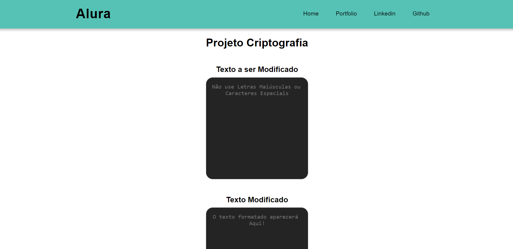

<h1 align="center"> Projeto Alura - Criptografia</h1>

Projeto pela Alura ONE de Criptografia

---

 

  

---
## 💻 Tecnologias

Esse projeto foi desenvolvido com as seguintes tecnologias:

- HTML5
- CSS3
- Javascript
- Git e Github

---

## 🚧 Projeto

Este projeto foi desenvolvido durante o curso Alura One, fazendo funções de Criptografar, Descriptografar, Limpar e Copiar o Texto.

As "chaves" de criptografia que utilizaremos são:
A letra "e" é convertida para "enter"
A letra "i" é convertida para "imes"
A letra "a" é convertida para "ai"
A letra "o" é convertida para "ober"
A letra "u" é convertida para "ufat"

Requisitos:
- Deve funcionar apenas com letras minúsculas
- Não devem ser utilizados letras com acentos nem caracteres especiais
- Deve ser possível converter uma palavra para a versão criptografada e também retornar uma palavra criptografada para a versão original.

Por exemplo:
"gato" => "gaitober"
gaitober" => "gato"

A página deve ter campos para inserção do texto a ser criptografado ou descriptografado, e a pessoa usuária deve poder escolher entre as duas opções
O resultado deve ser exibido na tela.

Você pode ver o site neste link: [Alura Criptografia]([https://nigerade.github.io/meu-portfolio/](https://nigerade.github.io/Alura-Criptografia/))

--- 
